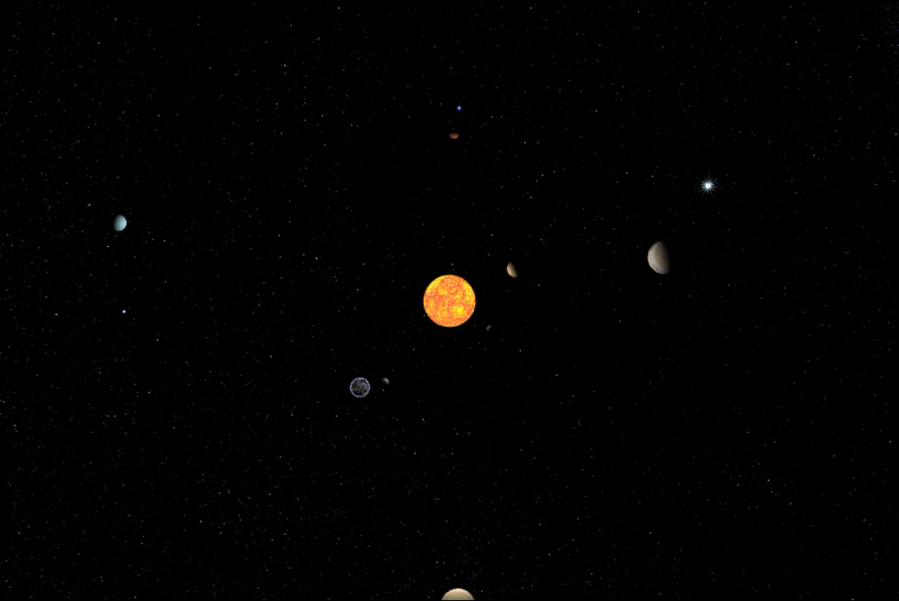
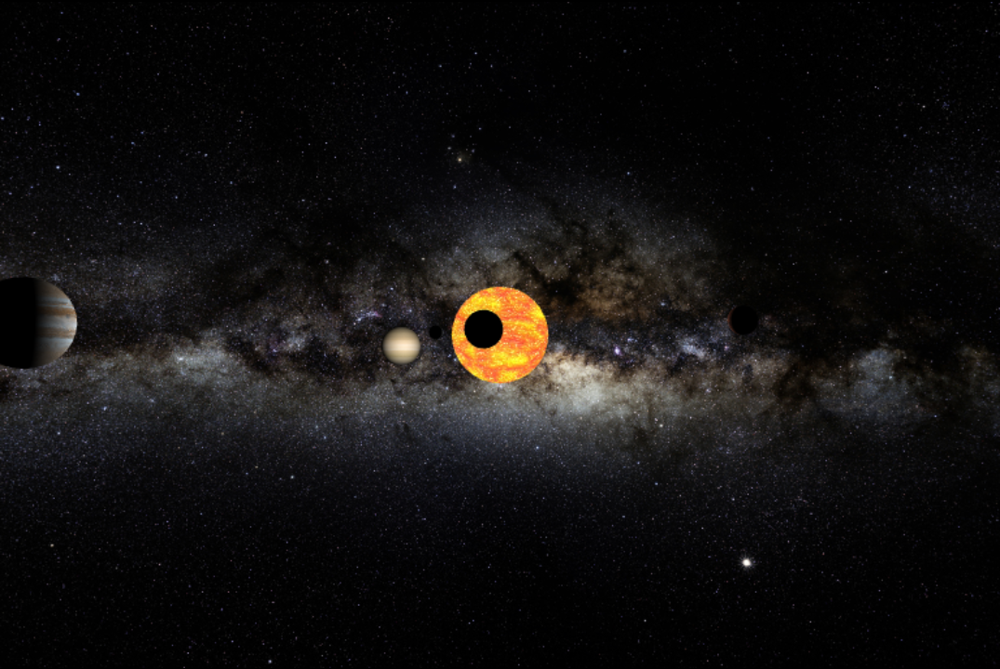

# Solar System Model

Open the Solar System in you web browser. Watch all eight planets (sorry Pluto) orbit around our plasma ball.

## How to run

In order to view on a local machine, open the app.js file in a vscode editor and launch a live server add-on.

## Bugs

Some functionality is broken in Firefox: cannot zoom into the Solar System. 
